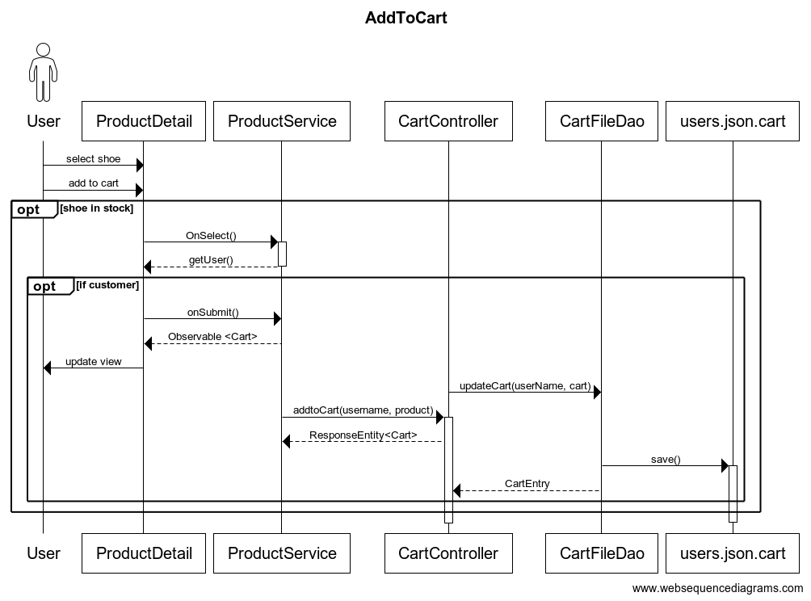
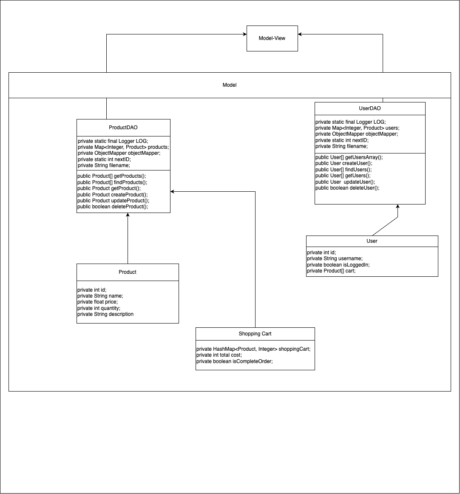
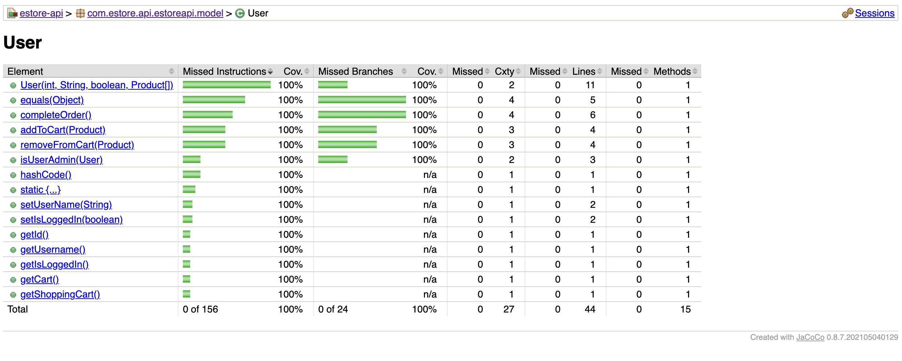

# **Executive Summary**

Our project is the creation of a fully-implemented estore for
selling popular sneakers to customers, with functionality to
allow the admin to manage the inventory of the store.

## **Purpose**

The site operates as an estore to sell sneakers to online customers. The goal of our website is to
provide an accessible shop website for customers to make purchases and owner(s) to view and edit their
shop accordingly.

## **Glossary and Acronyms**

| Term    | Definition                                                                |
| ------- | ------------------------------------------------------------------------- |
| MVP     | Minimum Viable Product                                                    |
| JSON    | JavaScript Object Notation                                                |
| SPA     | Single Page                                                               |
| Product | An object representing part of Product's customization                    |
| DAO     | Data Access Object                                                        |
| Product | An object dictating a product and that product's quantity and description |
| REST    | Representational state transfer                                           |
| API     | Application Programming Interface                                         |

# **Requirements**

This section describes the features of the application.

## **Definition of MVP**

Our site requires the following principal features to function to an acceptable level:

-   Login/Logout features for customer and Admin.
-   Selections of products in the inventory.
-   Shopping cart storage depending on logged in user.
-   A way for customers to view and select from available products in inventory.
-   A navigable, attracting, user-friendly website that includes all of the above.

## **MVP Features**

The main Epics required to complete the website include the following:

-   Epic : Authentication
-   Epic : Inventory Controls
-   Epic : Buyer's Shopping Carts
-   Epic : Browse Products
-   Epic : Checkout
-   Epic : Shopping Cart
-   Epic : 10% Feature

## **Roadmap of Enhancements**

For the user, there will be convenient accessibility to site for shipping and discount code features.

To ensure that our customers receive the best possible experience, we will prioritize the implementation of customer-focused enhancements such as customization options (e.g. shoe size), improved usability, and optimizing the flow of the website. Following this, we will shift our attention towards enhancing the owner's experience by introducing improved inventory customization.

# **Application Domain**

The website operates through the UI-implemented broswer site, for use by both customers and owner. The
application's domain does exist as a retail-business website.

The major entities of our domain model are : Server, Admin, Customer, Inventory/Products, Shopping Cart and Checkout.

The Servers allows the functionality to either login as a user (customer) or as an e-store owner (admin).

The inventory of products can be viewed by the Admin, who also has the ability to add, edit, and remove products. This means that the Store Owner has the authority to modify the sneaker offerings in the store. It should be noted, however, that the Admin does not have access to a ShoppingCart.

Before a user (customer) can proceed with making a purchase on the website, they must first create an account by registering. Upon registration, the customer will receive a unique username and a ShoppingCart associated with their account. The buyer is then able to add products to their ShoppingCart and remove items as needed. Additionally, they have the ability to browse the list of available products for purchase and search for specific products of interest.

When viewing their ShoppingCart, the buyer has the option to remove a product from their selection. Furthermore, they have the ability to apply a discount code to their purchase in order to save money. In addition, customers are given a variety of shipping methods to choose from in order to expedite the delivery of their products.

During the Checkout process, the customer is given the option to pay for their selected items using either a credit card or dining dollars. Once the payment is processed and the Checkout is complete, the purchased items will be deducted from the inventory and the contents of the customer's ShoppingCart will be cleared.

# **Architecture and Design**

This section describes the application architecture.

### **Summary**

The following Tiers/Layers model shows a high-level view of the webapp's architecture.

The e-store web application, is built using the Model–View–ViewModel (MVVM) architecture pattern.

The Model stores the application data objects including any functionality to provide persistance.

The View is the client-side SPA built with Angular utilizing HTML, CSS and TypeScript. The ViewModel provides REST APIs to the client (View) as well as any logic required to manipulate the data objects from the Model.

Both the ViewModel and Model are built using Java and Spring Framework. Details of the components within these tiers are supplied below.

### **Overview of User Interface**

This section describes the web interface flow; this is how the user views and interacts
with the e-store application.

The website has a homepage that displays graphics representing the company's brand. A navigation bar at the top of the page allows users to easily access the DashBoard, Products, Search, login/out, and Shopping Cart pages. Each of these pages also includes the navigation bar for seamless movement between different sections of the website. Furthermore, each listed shoe has a link to its specific page.

For owners, additional editing features are available after logging in. This includes a Products page to modify the website's inventory. These admin-only tabs are not visible or accessible to non-admin accounts.

### **View Tier**

| Name           | Function                                                            |
| -------------- | ------------------------------------------------------------------- |
| dashboard      | Displays a catalog of products(shoes) that are available on the website.   |
| login          | Offers a page for users to either log in or sign up for an account.             |
| messages       | shows messages according to what happening at a given time                      |
| products       | Used to show products on Products and Dashboard page                |
| product-detail | Maps to /products:id send to by products page for adding to ShoppingCart |
| product-search | Provides a space to search for products by name                     |
| shopping-cart  | Enables users to access and edit their ShoppingCart.  |
| checkout       | Allows user/customer to purchase the shoes in their shopping cart        |

### **Components Narrative**

Upon entering the website, the user is greeted with a login prompt that is managed by the app component. Additionally, the website includes a product-search component that displays a search bar for the user to utilize on the Dashboard page.

**Customer/User :** When the customer selects the "Products" option from the navigation bar, a list of items is displayed in the form of card panels, which are managed by the Product component. If a specific product is clicked on, the customer is directed to a page controlled by the product-detail component. This page displays an image of the product along with a form for adding the item to the ShoppingCart.

Upon arriving on the product page, the customer is prompted to log in before they can add the item to their ShoppingCart. By clicking the login button, the customer is directed to the login component's page where they can either create a new account or log in to an existing one. After logging in, the customer is taken back to the home page, where they can access the shopping cart button on the navigation bar.

Upon returning to the product page, the customer is now able to add the item to their ShoppingCart. Clicking on the shopping cart button in the navigation bar takes the customer to the ShoppingCart component's page. If all of the selected quantities are valid, the customer can proceed to the checkout page, which is managed by the checkout component, thereby concluding the customer's journey.

**Admin :** The admin's journey begins with the homepage, similar to any other user. However, after arriving at the login page, the admin is granted access to additional features only if authorized by the system. These features include managing products and purchases.

The Product component provides the admin with a comprehensive overview of all items and enables them to make changes such as deleting, editing, or adding an item. If the admin chooses to add an item, a modal window managed by the add-product component prompts them to enter the item's name, quantity, description, and price. After submitting the details, the admin is redirected back to the product page, and the new product is displayed. If the admin decides to edit a product, they can do so through the product-detail component, where they can modify the quantity, price, or description of the item. After submitting the updated information, the admin is returned to the products page with the updated item displayed.

### **API Endpoints (REST)**

| Name           | Request |   Output  |
| -------------- | ------- | --------- |
| productGetter    | GET     | Product   |
| searchingForProducts | GET     | Product[] |
| productsGetter    | GET     | Product[] |
| productGetter     | GET     | Product   |
| productCreator  | POST    | Product   |
| productUpdator  | PUT     | Product   |
| productDeletion  | DELETE  | Product   |
| cartGetter        | GET     | Product[] |
| cartAdder      | POST    | Product   |
| removeFromCart | PUT     | Product   |
| idGetter          | GET     | User      |
| usernameGetter    | GET     | User      |
| getIsLoggedIn  | GET     | User      |
| userLogout    | POST    | User      |
| userLogin | POST    | User      |

## **Sequence Diagrams: **

.png)

.png)

.png)

# **ViewModel Tier**

he view model tier acts as a mediator between the front-end and back-end of the website and is responsible for managing HTTP requests and handling errors. Two services, namely products.service and login.service, are responsible for controlling the view model. Products.service is responsible for handling requests related to the site's inventory, such as adding or modifying products. On the other hand, login.service manages login and logout requests and ensures that unauthorized access is prevented.

### **Model-View Tier UML Diagram**
\

### **ViewModel : Class Diagram**

# **Model Tier**

The Model tier is responsible for managing the manipulation and logical operations on all data related to users, products, and shopping carts. Each component of the model has a corresponding Controller and Persistence file, except for the ShoppingCart.

### **Persistence**

The implemented interfaces are associated with JSON files that are managed accordingly. These files are retrieved only once during the instantiation of the class and are written only if a specific operation requires it. In Spring Boot, all components are singletons, which ensures that this process happens only once.

### **User**

The UserFileDao module is responsible for writing data to the users.json file. It provides basic functionalities such as sign-up, login, logout, and fetching user details for both logged-in and non-logged-in users. The User entity may contain null fields or non-instantiated fields.

When a user logs in, the Login method of UserFileDao checks if the username exists in the JSON file. If it does, it returns the corresponding User entity; otherwise, it returns null.

When a user signs up, UserFileDao ensures that the username is unique, and it returns null if the username already exists in the file. For logout functionality, the token associated with the user is deleted. If the user does not exist, no error is returned.

To fetch user information, the token must be defined in the User entity, and UserFileDao will retrieve the user's details associated with that token.

### **Products**

The ProductFileDao manages the products.json file and provides several methods to interact with the data.

The **getProduct** method fetches a product from the file based on the product ID.

The **createProduct** method adds a new product to the inventory with a unique ID if all the required fields are properly filled.

The **updateProduct** method replaces the product with the specified ID with a new product object.

The **deleteProduct** method removes a product from the inventory by the product ID.

The isSameProductAndCanPurchase method is used to verify if a cart entry contains the latest information about a product, such as price and quantity, and if the quantity is greater than 0. This is necessary to ensure that the information is up-to-date and prevent issues where a user tries to purchase a product that has already been sold out. For example, if a user adds a product to their cart with a quantity of 5, but someone else purchases all 5 before the user checks out, the system needs to update the available quantity before the user can proceed with the purchase.

### **Entities of Model**

**Product :** The Product entity consists of a name, price, and description. The total price of all items in a User's shopping cart is calculated based on the number of items present.

**ShoppingCart :** The ShoppingCart entity represents products added to a User's shopping cart.

**User :** A User entity includes a token and a username. The token is not exposed to any class that might hold a reference to it. Each token is linked to a current login session, providing two benefits:

1. Users can invalidate their session by logging out or deleting their token.
2. Over an insecure connection, HTTP request body can be read, and if it contains any sensitive information, it is not secure.

# **Static Code Analysis/Design Improvements**

We utilize sonarqube to study our code, both for the API side and the frontend. Although sonarqube can
analyze code coverage they will be discussed in the testing section.

Running sonarqube on projects will display the following dashboard.

The sonarqube analysis revealed an issue with the "font-family" parameter in our CSS files. Specifically, some instances in the shopping cart CSS are missing the required generic font family parameter (e.g. serif or sans-serif). This can potentially result in the browser displaying a generic font if the chosen font is not supported. To address this issue, the parameter should be updated to include the missing generic font family.

Sonarqube has highlighted a potential issue with the updateUser method in the UserFileDAO class. It pointed out that synchronizing on the user object, which is a method parameter, could cause problems when the object's value changes during the function's execution. In such cases, the object would become unsynchronized, allowing other threads to access the synchronized block and making it ineffective. To address this issue, it is recommended to create a lock object that is specifically designed for synchronization.

The static analysis of our codebase revealed a minor issue with the Estore API Application tests. Specifically, it pointed out that there are no assert statements present in the tests. Upon closer inspection, it became clear that some of the tests lack sufficient functionality and simply occupy unnecessary space. Therefore, it is recommended to delete these tests to improve code clarity and conserve space.

The static analysis of our codebase has identified another minor issue regarding the construction of arguments for certain log methods. It was found that string concatenation is used for this purpose, which could lead to a potential performance degradation. To avoid this, we could use built-in string formatting instead. Additionally, we could consider adding conditionals before the log statements to ensure that they are only executed when necessary, further reducing the performance impact.

### **Design : Controller**

The principle of a controller is to deal with system events to a non UI class that represents the overall system or a use-case scenario. The object made of a Controller Class is meant to receive and/or handle system events.

Our project is planned to be built around the functionality of our e-store. The functionality of our e-store includes the ability to add a product, remove a product, search for a product, get a certain product, and to get all the products in our catalog. As such, to implement this functionality, we make use of a Controller Class in our project through methods that get and add items to our inventory:

**Improvements:** To get better adherence to this principle, we could potentially work towards merging very similar functions in our Controller class into one function, so as to generalize the system calls that would be made depending on user actions. For example, at the time of writing, our Controller Class contains a getProduct function and a getProducts function. The getProduct function is meant to get a specific product depending on its ID number passed as a parameter, while the getProducts function is meant to return a list of all the products that are in our inventory. We could potentially merge the functions together such that unless an id is specified, we could return the entire list of products in our inventory, else we could just return the product corresponding to the id number passed through the function when called.

### **Design : Application**

This principle states that high level modules should only have high level implementation and use them as an interface rather than being in touch with the low level thing directly.

For our project, this instance can be seen when the HTTP request is resolved into saving to the file. The view just sends a request to the controller. For example :

In this case, it does not interact with the file system. This makes it simpler, because if in the future this were to be connected with a different database. Because the interface is implemented like so:

Here, the implementation is not defined, so it can mean anything like file I/O, noSQL etc. Thus, it is more adaptable.

**Improvements:** Currently, the principle is not maintained if let's say for example someone needs to find a product name in its entirety. The find method described in the earlier rule, does not allow that person to look for text in its entirety. This is a problem because looping over the resulting array from the find method is interacting at a lower level than needed.

### **Design : Single Responsibility**

A single responsibility design relies on multiple classes that each have one clearly defined purpose rather than multiple purposes. This in itself can allow the programmer to reuse functions for a variety of uses, reduce the amount of code being written multiple times over, have an easier time passing tests considering there should be less instances that need to be tested on, and understand scope better.

In our webstore when a mod wants to update a product we use the same method for every type of update (i.e. Price, Quantity, Name). We also utilize single responsibility by using the same product object for every product in the webstore. This saves time and better utilizes the OOP design principle.

**Improvements:** In the future we can merge certain methods to allow for easier and faster implementation. As mentioned earlier we could always merge methods like gteProduct and getProducts by allowing some arguments to be passed to the method.

### **Design : Open-Closed**

The Open-Closed Principle states that “software entities should be open for extension, but closed for modification”, with software entities including classes, modules and functions. An open module is available for extension meaning that you can add things to it. A closed extension is only available for use from other modules, but you can’t add to it.

In our project, the open-closed principle is implemented by the use of a persistence class, which serves as an interface to be used by our controller class (this instance is what is defined by Meyers as a closed module), ProductDAO.java and ProductController.java respectively. Additionally, another instance of this would be our Product.java class, which would be an instance of an open module, seeing as we can add new fields to the data structures it contains (eg. We can assign a new quantity to the product, or a new price). Excerpts of our code is shown below showing the import of ProductDAO.java and its interface definition, as well as the function setQuantity from Product.java:

**Improvements:** One suggestion for better implementation of the open-close principle would be to make use of the protected class definition, which, while allowing for the functions of one class to be accessed by another for the same class, would prevent them from being accessed by other packages or be changed in any way other than intended, given that the definition public, which is used for most of our functions currently, allows for any class in any package to access the functions of a class.

# **Testing**

Unit testing was utilized when testing the API methods. The tests performed
were exhaustive in an attempt to get 100% test coverage on all of our methods.
All API methods have 100% test coverage in jacoco.

### **Acceptance Testing**

Desribed below are the current stories' acceptance criteria status:

| Story                                       | Acceptance Criteria status |
| ------------------------------------------- | -------------------------- |
| Create New Product                          | Passed                     |
| Delete a single product                     | Passed                     |
| Search for a product                        | Passed                     |
| Update a Product                            | Passed                     |
| Get Entire Inventory                        | Passed                     |
| Add Items to Shopping Cart                  | Passed                     |
| Delete Items from Shopping Cart             | Passed                     |
| Product List                                | Passed                     |
| Purchasing Items Remove Them From Inventory | Passed                     |
| Search Product                              | Passed                     |
| View Shopping Cart                          | Passed                     |
| Shopping Cart Final Cost                    | Passed                     |
| Admin login and logout                      | Passed                     |
| Admin Controls                              | Passed                     |
| Customer login and logout                   | Passed                     |
| Shopping Cart Persistance                   | Passed                     |
| Discount Codes(10% feature)                 | Passed                     |
| Shipping Options(10% feature)               | Passed                     |
| Payment with Dining Dollars or Credit Card  | Passed                     |

### **Unit Testing and Code Coverage**

OOur tests were based on the SWEN provided unit tests but were adapted to work with other methods. We set a coverage target of 100%, which we were able to achieve. During testing, we only encountered an anomaly with the ProductFileDAO, where 100% coverage could not be attained if the product IDs did not start at 0. Overall, the testing process was smooth .

### **estore-api**

### **Controller**

### **Persistance**

### **Model**

### **Utilities**

